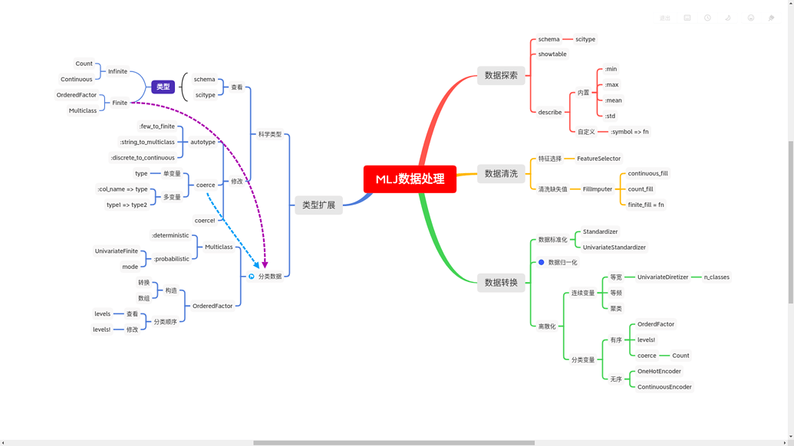
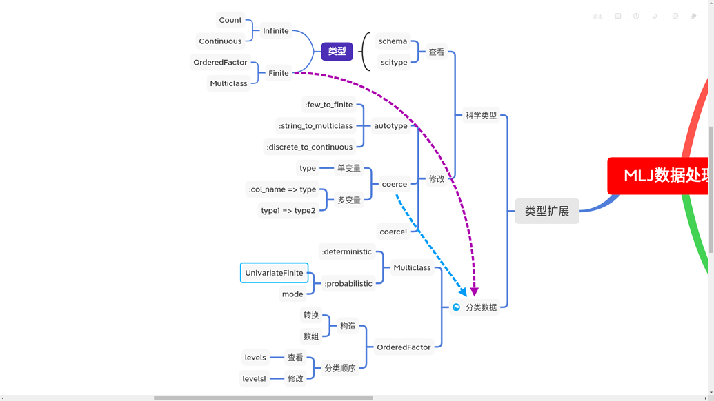
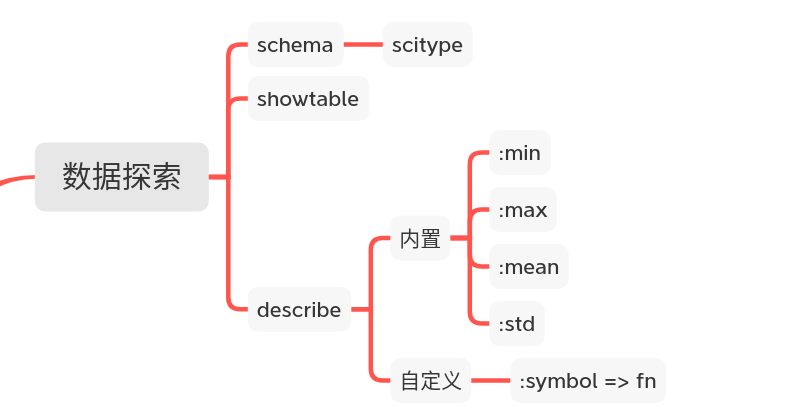

[TOC]


## 0. [非常重要] 类型扩展

我们先准备下数据，以波士顿房价为例，不过我们不用**MLJ**的`@load_boston`了，因为我们有许多工作需要`DataFrame`来完成
```julia
using MLJ
using TableView # for showtable

using RDatasets
boston = dataset("MASS", "Boston");
y, X = unpack(boston, col -> col == :MedV, col -> col != :MedV) # MedV 平均房价特征
```
**tips** 
unpack拆包数据集，可以分别用函数指定需要的数据集
### 0.1 科学类型
#### 0.1.1 科学类型介绍
**MLJ**扩展出了一系列类型来更好地解释数据集，这种类型叫做[科学类型](https://alan-turing-institute.github.io/DataScienceTutorials.jl/data/scitype/#type_to_type_coercion)
**科学类型**还为模型和指标的**搜索**,**查询**提供了便利
**模型**
```julia
models(matching(X,y))
models(matching(X))
```

```julia
julia> info("RidgeRegressor", pkg="MLJLinearModels")
...
# 输入数据的科学类型
 input_scitype = Table{_s23} where _s23<:(AbstractArray{_s25,1} where _s25<:Continuous),
 # 输出数据的科学类型
 target_scitype = AbstractArray{Continuous,1},
...
```

**指标**

```julia
measures(matching(y))
```

```julia
julia> info(l1)
absolute deviations; aliases: `l1`.
...
# 虽然也是target，但这个其实是输入的数据类型
 target_scitype = Union{AbstractArray{Continuous,1}, AbstractArray{Count,1}},
...
```

#### 0.1.2 查看科学类型
在数据分析中用到科学类型最多的类型有两种，一种是无限数据`Infinite`，另一种是有限数据`Finite`
这里有[更详细的资料](https://alan-turing-institute.github.io/MLJScientificTypes.jl/dev/)
**Infinite**
1. Continuous
   连续数据(其实是小数)
2. Count 
   计数数据(其实跟上面的差不多，只不过是整数)
**Finite**
1. OrderdedFactor
   有序的分类数据，像是`["bad", "soso", "good"]`这样，可以比较
2. Multiclass
   无序的分类数据，像是`["Julia", "Rust", "Clojure"]`这样，没有任何联系
   
   
通常对数据集(带有特征字段的命名元组和`DataFrame`)采用`schema`
` schema(boston)`

| _.names | _.types | _.scitypes |
|:-------:|:-------:|:----------:|
| Crim    | Float64 | Continuous |
| Zn      | Float64 | Continuous |
| Indus   | Float64 | Continuous |
| Chas    | Int64   | Count      |
| NOx     | Float64 | Continuous |
| Rm      | Float64 | Continuous |
| Age     | Float64 | Continuous |
| Dis     | Float64 | Continuous |
| Rad     | Int64   | Count      |
| Tax     | Int64   | Count      |
| PTRatio | Float64 | Continuous |
| Black   | Float64 | Continuous |
| ⋮       | ⋮       | ⋮          |

对没有特征字段的数据可以采用`scitype`
` scitype([1,2,3]) `
` AbstractArray{Count, 1} `

#### 0.1.3 修改科学类型
修改科学类型用`coerce`，或可以用原地修改的`coerce!`
**等等，为什么要修改科学类型？**
分析数据时，区分
1. 数据如何编码（例如Int），以及
2. 应该如何解释数据（例如，类标签，计数等）

如何被编码的数据将被称为机器类型而数据应如何解释将作为被称为科学型（或scitype）

但是，在许多其他情况下，可能会有歧义，我们在下面列出一些示例：
1. Int向量例如[1, 2, ...]，应将其解释为分类标签，
2. Int向量例如[1, 2, ...]，应将其解释为计数数据，
3. String向量["High", "Low", "High", ...]，应将其解释为有序的分类标签，
4. String例如的向量["John", "Maria", ...]，应将其解释为无序的多分类数据
5. 浮点向量[1.5, 1.5, -2.3, -2.3]，应将其解释为分类数据（例如，某些设置的几个可能值）等。

为了了解决这种歧异，并更好的对数据集作出解释，我们可以手动修改数据集的科学类型
承接上面的例子
```julia
X = (col_1 = [1,2,3],
	 col_2 = [1,2,3],
	 col_3 = ["High", "Low", "High"],
	 col_4 = ["John", "Maria", "Mike"],
	 col_5 = [1.5, 1.5, -2.3, -2.3])
schema(X)	 
```
| _.name | _.types | _.scitypes |
|:------:|:-------:|:----------:|
| col_1   | Int64   | Count      |
| col_2   | Int64   | Count      |
| col_3   | String  | Textual    |
| col_4   | String  | Textual    |
| col_5   | Float64 | Continuous |

```julia
Xhat = coerce(X, :col_1 => OrderedFactor, # 这里的分类数据用OrderedFactor来做个例子好了
	      :col_2 => Count, # 可有可无
		  :col_3 => OrderedFactor,
		  :col_4 => Multiclass,
		  :col_5 => Multiclass) 
schema(Xhat)
```
| _.names | _.types                          | _.scitypes       |
|:-------:|:--------------------------------:|:----------------:|
| col_1   | CategoricalValue{Int64,UInt32}   | OrderedFactor{3} |
| col_2   | Int64                            | Count            |
| col_3   | CategoricalValue{String,UInt32}  | OrderedFactor{2} |
| col_4   | CategoricalValue{String,UInt32}  | Multiclass{3}    |
| col_5   | CategoricalValue{Float64,UInt32} | Multiclass{2}    |

**那么有没有省力的方法帮助我们修改科学类型？**
可以用`autotype`来指定一些选项，如
1. :few_to_finite 如果向量中数据很少，但有很多重复的，转为分类类型`Finite`
2. :discrete_to_continuous 将离散的`Count`, `Integer`转为`Continuous`
3. :string_to_multiclass 将`String`变量转为多分类变量
举几个例子
`autotype(X, :few_to_finite)`

```julia
Dict{Symbol,Type} with 5 entries:
  :col_5 => OrderedFactor
  :col_2 => OrderedFactor
  :col_3 => Multiclass
  :col_4 => Multiclass
  :col_1 => OrderedFactor
```
`autotype(X, :discrete_to_continuous)`
```julia
Dict{Symbol,Type} with 2 entries:
  :col_2 => Continuous
  :col_1 => Continuous
```
`autotype(X, :string_to_multiclass)`
```julia
Dict{Symbol,Type} with 2 entries:
  :col_3 => Multiclass
  :col_4 => Multiclass
```
如果要传入多个参数，把他们包装起来
autotype(X, (:string_to_multiclass, :few_to_finite))
```julia
Dict{Symbol,Type} with 5 entries:
  :col_5 => OrderedFactor
  :col_2 => OrderedFactor
  :col_3 => Multiclass
  :col_4 => Multiclass
  :col_1 => OrderedFactor
```
最后，只用把返回的字典带入`coerce`中就可以了
```julia
coerce(X, autotype(X, :string_to_multiclass)) |> schema
```
| _.names | _.types                                           | _.scitypes    |
|:-------:|:-------------------------------------------------:|:-------------:|
| col_1   | Int64                                             | Count         |
| col_2   | Int64                                             | Count         |
| col_3   | CategoricalArrays.CategoricalValue{String,UInt32} | Multiclass{2} |
| col_4   | CategoricalArrays.CategoricalValue{String,UInt32} | Multiclass{3} |
| col_5   | Float64                                           | Continuous    |

**补充**
对没有特征字段的数据，`coerce`直接在写类型参数就可以了: `coerce([1,2,3], Continuous) # [1.0, 2.0, 3.0]`
### 0.2 分类数据
`CategoricalArray`是为了完善科学类型中的`Finite`分类类型，专门设计的分类数据
#### 0.2.1 `OrderedFactor` 有序的分类数据
1. 转换
```julia
julia> x1 = coerce([1,2,3], OrderedFactor)
3-element CategoricalArrays.CategoricalArray{Int64,1,UInt32}:
 1
 2
 3
```
2. 构造
```julia
julia> x2 = categorical([1,2,3], ordered=true)
3-element CategoricalArrays.CategoricalArray{Int64,1,UInt32}:
 1
 2
 3
```
3. 查看分类顺序
```julia
julia> levels(x1)
3-element Array{Int64,1}:
 1
 2
 3
```
4. 改变分类顺序
```julia
julia> levels!(x1, [3,2,1])
3-element CategoricalArrays.CategoricalArray{Int64,1,UInt32}:
 1
 2
 3

julia> levels(x1)
3-element Array{Int64,1}:
 3
 2
 1
```
#### 0.2.2 Multiclass 无序的分类数据
在搜索分类模型的时候，如果你细心点，你会发现一些不同
```julia
info("DecisionTreeClassifier").prediction_type == :probabilistic # true
info("SVMClassifier", pkg="ScikitLearn").prediction_type == :deterministic # true
```
其中
`:probabilistic` 指预测时返回的数据是每个分类的概率，如
```julia
import RDatasets
iris = RDatasets.dataset("datasets", "iris")
y, X = unpack(iris, ==(:Species), colname -> true)
@load DecisionTreeClassifier
tree_model = DecisionTreeClassifier()

tree = machine(tree_model, X, y)
train, test = partition(eachindex(y), 0.7, shuffle = true)
fit!(tree, rows=train)
yhat = predict(tree, rows=test)
```

```julia
 UnivariateFinite{Multiclass{3}}(setosa=>1.0, versicolor=>0.0, virginica=>0.0)
 UnivariateFinite{Multiclass{3}}(setosa=>0.0, versicolor=>1.0, virginica=>0.0)
 UnivariateFinite{Multiclass{3}}(setosa=>0.0, versicolor=>0.0, virginica=>1.0)
...
```
如何获取概率最大的分类呢？？
用`mode`函数
```julia
mode.(yhat)
```
**tips** 
你如果想在预测的时候直接得到分类，就用`predict_mode`
```julia
setosa
versicolor
virginica
...
```
`:deterministic` 指预测时i返回的数据是单独的一个类别，如
```julia
@load SVMClassifier pkg=ScikitLearn
clf = fit!(machine(SVMClassifier(), X, y))
yhat = predict(clf, X)
```

```julia
 "setosa"
 "setosa"
 "setosa"
...
```
数据太多，就贴三个把:yum:
详细的分类数据文档可以[看这里](https://alan-turing-institute.github.io/MLJ.jl/stable/working_with_categorical_data/)

已有位小伙伴已经翻译好了文档，大家可以看看
https://github.com/noob-data-analaysis/data-analysis/blob/master/%5B%E6%95%B0%E6%8D%AE%E5%8F%98%E6%8D%A2%5D%40AquaIndigo/%E6%95%B0%E6%8D%AE%E5%8F%98%E6%8D%A2.md
## 1. 数据探索

### 1.1 总览 `showtable`
`showtable(X) # 这个大家在jupyter notebook里试一下就好了，我这里不能导出markdown， 我让别人帮我试了一下也有问题，那就是作者的问题了`
### 1.2 查看每列的科学类型 `schema`
` schema(boston)`

| _.names | _.types | _.scitypes |
|:-------:|:-------:|:----------:|
| Crim    | Float64 | Continuous |
| Zn      | Float64 | Continuous |
| Indus   | Float64 | Continuous |
| Chas    | Int64   | Count      |
| NOx     | Float64 | Continuous |
| Rm      | Float64 | Continuous |
| Age     | Float64 | Continuous |
| Dis     | Float64 | Continuous |
| Rad     | Int64   | Count      |
| Tax     | Int64   | Count      |
| PTRatio | Float64 | Continuous |
| Black   | Float64 | Continuous |
| ⋮       | ⋮       | ⋮          |

**注意**

### 1.3 自定义查看内容 `describe`
需要注意的是，`describe`不能对命名元组起作用，需要`DataFrame`类型，这个函数是专门为`DataFrame`设计的
#### 1.3.1 内置功能
```julia
describe(X, :nmissing) # 每一列有missing的数量
13×2 DataFrame
```
| Row | variable | nmissing |
|:---:|:--------:|:--------:|
|     | Symbol   | Nothing  |
| 1   | Crim     |          |
| 2   | Zn       |          |
| 3   | Indus    |          |
| 4   | Chas     |          |
| 5   | NOx      |          |
| 6   | Rm       |          |
| 7   | Age      |          |
| 8   | Dis      |          |
| 9   | Rad      |          |

```julia
describe(X, :min, :max, :mean, :std) # 每一列的最小值，最大值，平均值，标准差，他们会跳过missing
```

| Row | variable | min     | max     | mean     | std      |
|:---:|:--------:|:-------:|:-------:|:--------:|:--------:|
|     | Symbol   | Real    | Real    | Float64  | Float64  |
| 1   | Crim     | 0.00632 | 88.9762 | 3.61352  | 8.60155  |
| 2   | Zn       | 0.0     | 100.0   | 11.3636  | 23.3225  |
| 3   | Indus    | 0.46    | 27.74   | 11.1368  | 6.86035  |
| 4   | Chas     | 0       | 1       | 0.06917  | 0.253994 |
| 5   | NOx      | 0.385   | 0.871   | 0.554695 | 0.115878 |
| 6   | Rm       | 3.561   | 8.78    | 6.28463  | 0.702617 |
| 7   | Age      | 2.9     | 100.0   | 68.5749  | 28.1489  |
| 8   | Dis      | 1.1296  | 12.1265 | 3.79504  | 2.10571  |
| 9   | Rad      | 1       | 24      | 9.54941  | 8.70726  |
| 10  | Tax      | 187     | 711     | 408.237  | 168.537  |
| 11  | PTRatio  | 12.6    | 22.0    | 18.4555  | 2.16495  |
| 12  | Black    | 0.32    | 396.9   | 356.674  | 91.2949  |
| 13  | LStat    | 1.73    | 37.97   | 12.6531  | 7.14106  |


#### 1.3.2 自定义功能
```julia
desribe(X, :symbol => fn) # fn作用于整个列
```
```julia
desribe(X, :symbol => sum) 
```
| Row | variable | symbol   |
|:---:|:--------:|:--------:|
|     | Symbol   | Real     |
| 1   | Crim     | 1828.44  |
| 2   | Zn       | 5750.0   |
| 3   | Indus    | 5635.21  |
| 4   | Chas     | 35       |
| 5   | NOx      | 280.676  |
| 6   | Rm       | 3180.02  |
| 7   | Age      | 34698.9  |
| 8   | Dis      | 1920.29  |
| 9   | Rad      | 4832     |
| 10  | Tax      | 206568   |
| 11  | PTRatio  | 9338.5   |
| 12  | Black    | 180477.0 |
| 13  | LStat    | 6402.45  |

## 2. 数据清洗

### 2.1 特征选择 `FeatureSelector`
**文档**
`FeatureSelector(features=Symbol[])`
**注意**
这个`model`用来选择`DataFrame`或`NamedTuple`的特征字段
**示例**
```julia
model = FeatureSelector([:Crim]) # 选择Crim的特征字段
mach = fit!(machine(model, X))
MLJ.transform(mach, X) |> df -> first(df, 5) # 这里的transform会与DataFrame的transform冲突，要指定模块为MLJ
```
表格太难打了，我这里就给出5个数据好了

| Row | Crim    |
|:---:|:-------:|
|     | Float64 |
| 1   | 0.00632 |
| 2   | 0.02731 |
| 3   | 0.02729 |
| 4   | 0.03237 |
| 5   | 0.06905 |

### 2.2 清洗缺失值 `FillImputer`
**文档**
```julia
FillImputer(
   features        = [],
   continuous_fill = e -> skipmissing(e) |> median
   count_fill      = e -> skipmissing(e) |> (f -> round(eltype(f), median(f)))
   finite_fill     = e -> skipmissing(e) |> mode)
```
**注意**
`FillImputer`可以指定特征列来填充`missing`值，默认的填充函数以给出，也可以自己定义
>   •    continuous_fill: function to use on Continuous data, by
        default the median
    •    count_fill: function to use on Count data, by default the
        rounded median
    •    finite_fill: function to use on Multiclass and OrderedFactor
        data (including binary data), by default the mode

**示例**
```julia
df = coerce((x1 = 1:3, x2 = [missing, 1, 2]), :x2 => Continuous)
schema(df)
```

| _.name | _.types                 | _.scitype                  |
|:------:|:-----------------------:|:--------------------------:|
| x1     | Int64                   | Count                      |
| x2     | Union{Missing, Float64} | Union{Missing, Continuous} |

```julia
model = FillImputer(continuous_fill = e -> skipmissing(e) |> mean)
mach = fit!(machine(model, df))
w = MLJ.transform(mach, df)	
schema(w)
```

```julia
julia> w = MLJ.transform(mach, df)
(x1 = 1:3,
 x2 = [1.5, 1.0, 2.0],)
```
| _.name | _.types                 | _.scitype  |
|:------:|:-----------------------:|:----------:|
| x1     | Int64                   | Count      |
| x2     | Union{Missing, Float64} | Continuous |

## 3. 数据转换

### 3.1 数据标准化 `Standardizer`
**文档**
`   Standardizer(; features=Symbol[], ignore=false, ordered_factor=false, count=false)
`
$$
newX = \frac{X' - mean(X)} {Std(X)}
$$

**注意**
其中
- X'   需要转换的数组
- X    用来拟合的原数据
- newX 转换X' 后的新数组

另外
`Standardizer`只对`Continuous`科学类型的数据有效，如果在数据集中有科学类型为`OrderedFactor`或`Count`的`nums`，可以在`Standardizer`中指定`ordered_factor=true`或`count=true`

**示例**
```julia
X = (ordinal1 = [1, 2, 3],
              ordinal2 = categorical([:x, :y, :x], ordered=true),
              ordinal3 = [10.0, 20.0, 30.0],
              ordinal4 = [-20.0, -30.0, -40.0],
              nominal = categorical(["Your father", "he", "is"]));

schema(X)
```
| _.names  | _.types                                           | _.scitypes       |
|:--------:|:-------------------------------------------------:|:----------------:|
| ordinal1 | Int64                                             | Count            |
| ordinal2 | CategoricalArrays.CategoricalValue{Symbol,UInt32} | OrderedFactor{2} |
| ordinal3 | Float64                                           | Continuous       |
| ordinal4 | Float64                                           | Continuous       |
| nominal  | CategoricalArrays.CategoricalValue{String,UInt32} | Multiclass{3}    |

尝试先不把`ordinal1`转换
```julia
model = Standardizer()
mach = fit!(machine(model, X))
transform(mach, X)
```
```julia
(ordinal1 = [1, 2, 3],
 ordinal2 = CategoricalArrays.CategoricalValue{Symbol,UInt32}[:x, :y, :x],
 ordinal3 = [-1.0, 0.0, 1.0],
 ordinal4 = [1.0, 0.0, -1.0],
 nominal = CategoricalArrays.CategoricalValue{String,UInt32}["Your father", "he", "is"],)
```

下面我们将`Count`和`OrderedFactor`转换
不过这里需要对`ordered_factor=true`另外说明
不管这个`nums`的内容是什么类型，`Standardizer`都能帮他转换。 
不过在此之前先会把`nums`转化为数字数组

```julia
# 先将X的ordinal2提取出来
temp = X.ordered2
nums = coerce(temp, Count)
# 3-element Array{Int64,1}:
#  1
#  2
#  1

model = UnivariateStandardizer() # UnivariateStandardizer 和 Standardizer 类似, UnivariateStandardizer不能用在命名元组DataFrame上，另外UnivariateStandardizer没有参数，不会忽略Count类型
mach = fit!(machine(model, nums)
transform(mach, nums)```

```julia
 -0.5773502691896256
  1.1547005383792517
 -0.5773502691896256
```
验证一下我们的想法
```julia
model = Standardizer(ordered_factor = true)
mach = fit!(machine(model, X))
transform(mach, X)
```
可以看到`ordered2`那里一毛一样
```julia
(ordinal1 = [-1.0, 0.0, 1.0],
 ordinal2 = [-0.5773502691896256, 1.1547005383792517, -0.5773502691896256],
 ordinal3 = [-1.0, 0.0, 1.0],
 ordinal4 = [1.0, 0.0, -1.0],
 nominal = CategoricalArrays.CategoricalValue{String,UInt32}["Your father", "he", "is"],)
```


### 3.2 数据归一化
文档里没有找到，可能要自定义模型了

### 3.3 数据离散化
1. 连续变量
本来连续变量的离散化分为等宽，等频，聚类等，但是在文档里只找到了等宽离散化的`UnivariateDiretizer`
**文档**
```julia
  UnivariateDiscretizer(n_classes=512)

  Returns an MLJModel for for discretizing any continuous vector v
  (scitype(v) <: AbstractVector{Continuous}), where n_classes describes
  the resolution of the discretization.
```
**注意**
等宽离散化，`n_classes`代表你想分多少个类
返回值为分类数组`OrderedFactor`
**示例**
这里我们对一个`1 ~ 100`的数组进行等宽离散化，我们把类别设置为10，转换一些随机数
```julia
data = coerce(1:100, Continuous)
t = UnivariateDiscretizer(n_classes = 10)
discretizer = fit!(machine(t, data))
v = rand(1:100, 10)
w = transform(discretizer, v)
```

| 随机数 v | 分类顺序 |
|:--------:|:--------:|
| 11       | 2        |
| 54       | 6        |
| 19       | 2        |
| 92       | 10       |
| 43       | 5        |
| 53       | 6        |
| 87       | 9        |
| 23       | 3        |
| 39       | 4        |
| 91       | 10       |

**tips** 
用`convert(Vector{Int}, w)`获得分类数据的排序情况

2. 分类变量
   1. 有序变量 `OrderedFactor`
	  在文档里没有这个模型，不过作者告诉我可以用`coerce`强制转换科学类型
	  如果按原有的分类顺序来转换
	  ```julia
	  nums = categorical([:x, :y:, :z], ordered=true)
	  levels(nums) # 1, 2, 3
	  coerce(nums, Count) # 1,2,3
	  coerce(nums, Continuous) # 1.0 2.0 3.0
	  ```
	  也可以改变分类顺序
	  ```julia
	  levels!(nums, [:z, :y, :z])
	  coerce(nums, Count) # 3, 2, 1
	  ```
   2. 无序变量 `Multiclass`
	  **文档**
	  有两个模型可以做这个，`OneHotEncoder`和`ContinuousEncoder`
	  ```julia
	    OneHotEncoder(; features=Symbol[],
                  ignore=false,
                  ordered_factor=true,
                  drop_last=false)
	  ```
	  
	  ```julia
		ContinuousEncoder(one_hot_ordered_factors=false, drop_last=false)
	  ```
	  **注意**
	  两个模型作用一样，在转换的过程中保留`Infinite`数据，转换`Multiclass`数据，不过`ContinuousEncoder`会丢弃无关的数据，如`Textual`数据，`OneHotEncoder`会保留所有特征字段
	  
	  额，他们怎么转换我说不清，看代码把:yum:
	  **示例**
	  1. `OneHotEncoder`
	  ```julia
	  data = (col = ["a", "b", "c"],)
	  nums = coerce(data, :col => Multiclass{3})
	  model = OneHotEncoder()
	  mach = fit!(machine(model, nums))
	  transform(mach, nums)
	  ```
	  
	  ```julia
	  (col__a = [1.0, 0.0, 0.0],
	  col__b = [0.0, 1.0, 0.0],
	  col__c = [0.0, 0.0, 1.0],)
	  ```
	  
	  2. `ContinuousEncoder`
	  ```julia
	  data = (col = ["a", "b", "c"],
	  vals = [1, 2, 3])
	  schema(data)
	  ```
      | _.names | _.types | _.scitypes |
      |:-------:|:-------:|:----------:|
      | col     | String  | Textual    |
      | vals    | Int64   | Count      |
	  
	  ```julia
	  model = ContinuousEncoder()
	  mach  = fit!(machine(model, data))
	  transform(mach, data)
	  ```
	  
	  ```julia
	  (vals = [1.0, 2.0, 3.0],)
	  ```
详细文档[在这里](https://alan-turing-institute.github.io/MLJ.jl/stable/transformers/)


