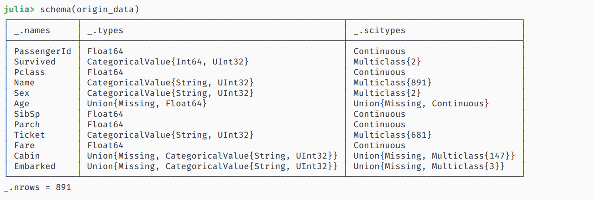
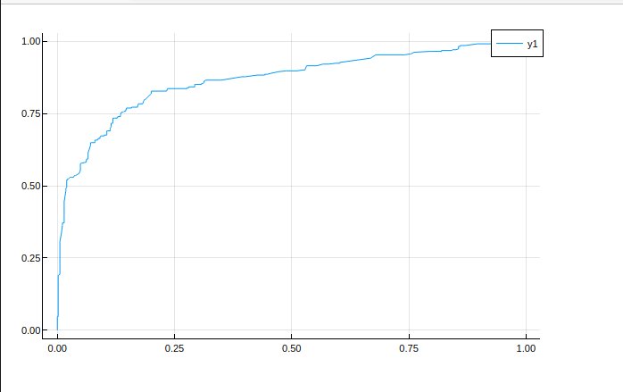

# 项目介绍

最近终于去学习 Julia 了，重温了下没做完的 Titanic 项目，打算做完  
那就先导入必要的库吧  

    using MLJ, DataFrames, StableRNGs, CSV, Plots
    plotly()

还要从 [Kaggle](https://www.kaggle.com/c/titanic/overview) 上下载好数据集 train.csv 与 test.csv ， 并用 CSV 模块加载  

    origin_data = CSV.read("data/train.csv", DataFrame)

到提交的时候，数据表中的字段 PassengerId(Integer) 与 Survived(Integer)  

# 数据探索

## 字段含义

我从网上查到这些字段的含义，有些字段的类型虽然是 **Float** ，但也是 1.0, 2.0之类的，比如 **Age**  

<table border="2" cellspacing="0" cellpadding="6" rules="groups" frame="hsides">

<colgroup>
<col  class="org-left" />

<col  class="org-left" />

<col  class="org-left" />
</colgroup>
<thead>
<tr>
<th scope="col" class="org-left">字段名称</th>
<th scope="col" class="org-left">字段含义</th>
<th scope="col" class="org-left">字段类型</th>
</tr>
</thead>

<tbody>
<tr>
<td class="org-left">PassengerId</td>
<td class="org-left">乘客ID</td>
<td class="org-left">Int</td>
</tr>

<tr>
<td class="org-left">Survived</td>
<td class="org-left">是否存活</td>
<td class="org-left">Int</td>
</tr>

<tr>
<td class="org-left">Pclass</td>
<td class="org-left">乘客等级(1/2/3等舱位)</td>
<td class="org-left">Int</td>
</tr>

<tr>
<td class="org-left">Name</td>
<td class="org-left">乘客姓名</td>
<td class="org-left">String</td>
</tr>

<tr>
<td class="org-left">Sex</td>
<td class="org-left">性别</td>
<td class="org-left">String</td>
</tr>

<tr>
<td class="org-left">Age</td>
<td class="org-left">年龄</td>
<td class="org-left">Float</td>
</tr>

<tr>
<td class="org-left">SibSp</td>
<td class="org-left">堂兄弟/妹个数</td>
<td class="org-left">Float</td>
</tr>

<tr>
<td class="org-left">Parch</td>
<td class="org-left">父母与小孩个数</td>
<td class="org-left">Float</td>
</tr>

<tr>
<td class="org-left">Ticket</td>
<td class="org-left">船票信息</td>
<td class="org-left">String</td>
</tr>

<tr>
<td class="org-left">Fare</td>
<td class="org-left">票价</td>
<td class="org-left">Float</td>
</tr>

<tr>
<td class="org-left">Cabin</td>
<td class="org-left">客舱</td>
<td class="org-left">String</td>
</tr>

<tr>
<td class="org-left">Embarked</td>
<td class="org-left">登船港口</td>
<td class="org-left">String</td>
</tr>
</tbody>
</table>

## 字段科学类型

这个数据集使用分类预测，先要统一好各个字段的科学类型，不然一些 model 对字段不起作用  
这里需要每个输入的数据类型是 **Continuous**, 而输出类型为 **Multiclass**  
使用 schema 查看情况  

    schema(origin_data)

  

## 描述数据

看看这个数据有多少缺斤少两的  

    describe(origin_data)

  

# 数据处理

探索完数据后，接下来可以  

-   填充缺失的数据
-   扔掉不用的数据
-   生成新的字段，或者优化数据

## 对 train.csv 的数据处理策略

从 train.csv 加载的数据中，我们发现  

-   Age 字段有缺失的数据，我们用众数填充
-   Embarked 字段有缺失的数据，同上
-   Cabin 字段缺失值太多，丢掉
-   我觉得 PassengerId, Name, Ticket 不会影响，丢掉

我们打算对票价 Fare 字段进行一些处理，大部分数据都是小数，数值之间相差太大，对其用函数  

f(x) = log(x + 1)  
进行划分，划分的结果为 1.0, 2.0, 3.0, 4.0, 5.0  

另外对一些特征进行整合，比如  

-   生成新字段 FeatureA: 将 age < 12 或 sex == "female" 的乘客化为 A 类，其余为 B 类
-   统计自己以及家人数量，将 SibSp 与 Parch 字段相加后，再加上自身的数量1
-   将 Embarked, FeatureA 字段进行 Onehot 编码
-   当然，新特征代替旧特征，旧特征可以丢弃了

不过在处理数据前，先把各个字段的科学类型转换好  

    typeTransformModel(dataframe::DataFrame) = begin
      if in("Survived", names(dataframe))
        coerce!(dataframe, :Survived => Multiclass)
      end
    
      coerce!(dataframe, Count => Continuous)
      coerce!(dataframe, Textual => Multiclass)
    
      return dataframe
    end

接下来定义数据处理模型  

### 填充缺失值

    fillMissingModel = FillImputer(features=[:Age, :Embarked], continuous_fill = e -> skipmissing(e) |> mode, finite_fill = e -> skipmissing(e) |> mode)

### 生成新的特征

    newFeatureModel!(dataframe::DataFrame) = begin
      # MODULE FeatureA 聚集 Age, Sex --> 12岁以下儿童以及妇女，12岁以上男性
      feature_filter_a(age, sex) = age >= 12 && sex == "male" ? "A" : "B"
      dataframe[!, :FeatureA] = map(feature_filter_a, dataframe[!, :Age], dataframe[!, :Sex])
    
      # MODULE FeatureB 聚集 SibSp, Parch ---> 家庭人员数量
      family_size(number) = begin
        if number == 1
          return 0
        elseif number >= 2 && number <= 4
          return 1
        else
          return 2
        end
      end
    
      dataframe[!, :FeatureB] = map(family_size, dataframe[!, :Parch] .+ dataframe[!, :SibSp] .+ 1)
    
      # MODULE FeatureC log(Fare + 1), encode(Pclass) -> 1, 2, 3  
      dataframe[!, :Fare] = map(floor, log.(dataframe[!, :Fare] .+ 1))
    
    
      # TODO don't forget to coerce scitype
      coerce!(dataframe, :FeatureA => Multiclass, :FeatureB => Continuous)
      return dataframe
    end

### 对 Embarked 进行 OneHot 编码

    encodeModel = OneHotEncoder(features=[:Embarked, :FeatureA])

### 丢弃不用的特征

    dropUnusedModel = FeatureSelector(features = [:Age, :Sex, :SibSp, :Parch, :Cabin, :PassengerId, :Name, :Ticket], ignore=true)

## 对 test.csv 的数据处理策略

从 test.csv 加载的数据与 train.csv 有点不同，  

-   缺失值有 Age, Fare，没有 Embarked
-   没有 Survived 字段

我们只需要重新为其定义填充缺失值的模型即可  

    fillMissingModel = FillImputer(features=[:Age, :Fare], continuous_fill = e -> skipmissing(e) |> mode)

## 数据处理模型

将各个模型串联起来，即可获得模型  

    transformModel = @pipeline typeTransformModel fillMissingModel newFeatureModel! encodeModel dropUnusedModel
    transformMachine = machine(transformModel, origin_data)

接下来拟合 transformMachine ，转换原始数据得到 outputdata  

    fit!(transformMachine)
    output_data = MLJ.transform(transformMachine, origin_data)

查看以下数据是否符合我们的预期  

    schema(output_data)

  

对 test.csv 的数据转换需要重新定义 fillMissingModel  

    origin_sample = CSV.read("data/test.csv", DataFrame)
    # generic typeTransformModel, ignore
    fillMissingModel = FillImputer(features=[:Age, :Fare], continuous_fill = e -> skipmissing(e) |> mode)
    
    # generic new feature generate
    # generic encode model
    # generic drop unused
    transformSampleModel = transformModel = @pipeline typeTransformModel fillMissingModel newFeatureModel! encodeModel dropUnusedModel
    
    transformSampleMachine = machine(transformSampleModel, origin_sample)
    fit!(transformSampleMachine)
    
    output_sample = MLJ.transform(transformSampleMachine, origin_sample)

## TODO 数据相关性

其实还可以看看各个字段间的相关性，画个热力图就行了，问了以下 Slack 的人，发现在 StatsPlots 中已经有函数 corrplot  
[相关文档在这](https://github.com/JuliaPlots/StatsPlots.jl#corrplot-and-cornerplot)  
但是吧这个图像好像不是热力图，我还是先放着吧  

# 模型训练

## 引入模型

这是个分类问题，我打算使用 LogisticClassifier ，其他分类器也可以  
从 MLJLinearModels 中导入模型  

    using MLJLinearModels
    @load LogisticClassifier pkg=MLJLinearModels
    clf = LogisticClassifier()

依据文档，其中的参数为  

-   penalty (Symbol or String): the penalty to use, either :l2, :l1, :en (elastic net) or :none. (Default: :l2)
-   lambda (Real): strength of the regulariser if penalty is :l2 or :l1. Strength of the L2 regulariser if penalty is :en.
-   gamma (Real): strength of the L1 regulariser if penalty is :en.
-   fitintercept (Bool): whether to fit an intercept (Default: true)
-   penalizeintercept (Bool): whether to penalize intercept (Default: false)
-   solver (Solver): type of solver to use, default if nothing.

## 拆解数据

先把特征字段和预测结果分开  

    Y, X = unpack(output_data, colname -> colname == :Survived, colname -> true)

再定义训练集和测试集的行数  

    rng = StableRNG(1234)
    train_row, test_row = partition(eachindex(Y), 0.7, rng=rng)

## 模型训练与调试

如果不需要调试模型的话，直接输入以下代码查看模型的训练情况  

    mach = machine(clf, X, Y)
    fit!(mach, rows=train_row)
    
    cv = CV(nfolds=6, rng=rng)
    evaluate!(mach, rows=test_row,
    	  measures=[cross_entropy, auc], resampling=cv)

  
对结果不满意的话，让我们来优化这个模型的参数，这里的优化策略使用 Grid，其中有三个维度  

-   range of lambda
-   range of penalty
-   range of gamma

他们的定义是  

    r_lambda = range(clf, :lambda, lower = 0.01, upper = 10.0, scale = :linear)
    r_penalty = range(clf, :penalty, values = [:l1, :l2])
    r_gamma = range(clf, :gamma, lower = 0, upper = 10.0, scale = :linear)

由于 penalty 不是连续的，设置范围的时候可以手动设置他的值  

设置好调优策略后，就可以新建一个自调优模型 selftuningmodel 来进行训练了  

    tuning = Grid(resolution = 5, rng = rng)
    
    self_tuning_model = TunedModel(model = clf,
    			       range = [r_lambda, r_penalty, r_gamma],
    			       tuning = tuning,
    			       resampling = CV(nfolds = 6, rng = rng),
    			       measure = cross_entropy)
    
    self_tuning_mach = machine(self_tuning_model, X, Y)
    fit!(self_tuning_mach, rows=train_row, verbosity=0)

调试完毕后，获取最优模型并评估  

    best_model = fitted_params(self_tuning_mach).best_model
    best_mach  = machine(best_model, X, Y)
    
    evaluate!(best_mach,
    	  resampling = CV(nfolds = 6, rng = rng),
    	  measure = [cross_entropy, area_under_curve], verbosity = 0)

看看训练结果  

  
好像没多少变化，那看看 roc 曲线  

  

# 投入使用

****注意****  
MLJ为分类结果定义了两种情况，一种是概率的，一种是二分的，而 LogisticClassifier 输出的结果是概率的  
生成数据的最后还需要处理一遍  

## 加载数据

    origin_sample = CSV.read("data/test.csv", DataFrame)

## 处理数据

当然别忘了重新定义 fillMissingModel  

    fillMissingModel = FillImputer(features=[:Age, :Fare], continuous_fill = e -> skipmissing(e) |> mode)

    transformSampleModel = transformModel = @pipeline typeTransformModel fillMissingModel newFeatureModel! encodeModel dropUnusedModel
    
    transformSampleMachine = machine(transformSampleModel, origin_sample)
    fit!(transformSampleMachine)
    
    output_sample = MLJ.transform(transformSampleMachine, origin_sample)

## 生成预测结果

    output_predict = mode.(predict(best_mach, output_sample)) |> nums -> convert(Vector{Int}, nums)
    
    output_frame = DataFrame()
    output_frame[!, :PassengerId] = convert(Vector{Int}, origin_sample[!, :PassengerId])
    output_frame[!, :Survived] = output_predict
    CSV.write("data/predict.csv", output_frame)

其中调用  

    mode(d::UnivariateDistribution)

mode 返回概率最大的数，在这里只有对0与1的概率  

## 上传数据

将 predict.csv 上传至 <https://www.kaggle.com/c/titanic/submit>  

  

